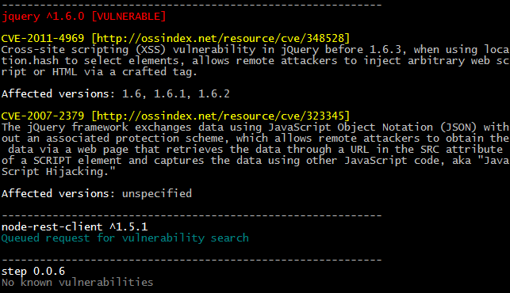

AuditJS
=======

Audits an NPM package.json file to identify known vulnerabilities.



Installation
------------
```
npm install auditjs
```

Usage
-----
```
Usage: node audit.js <dir>

  dir: Directory containing package.json file
```

Audit the dependencies defined in a specified package.json file to identify
known vulnerabilities as specified in the National Vulnerability Database
(NVD) found here: https://nvd.nist.gov/

A result for a package that returns 'Queued request for vulnerability search'
indicates that the package has been submitted at OSS Index for manual
cross referencing with the NVD. Once a package is cross references it
remains so, which means that over time we should approach complete coverage.
Cross referencing will be performed as quickly as possible. If you get
'queued' results we suggest you check again the following day -- you should
have complete results by that time.

Limitations
-----------

As this program depends on the OSS Index database, network access is
required. Connection problems with OSS Index will result in an exception.

The current version of AuditJS only reports on top level dependencies.
If feedback indicates people are interested we will extend auditing to run
against the full dependency tree

The NVD does not always indicate all (or any) of the affected versions
it is best to read the vulnerability text itself to determine whether
any particular version is known to be vulnerable.