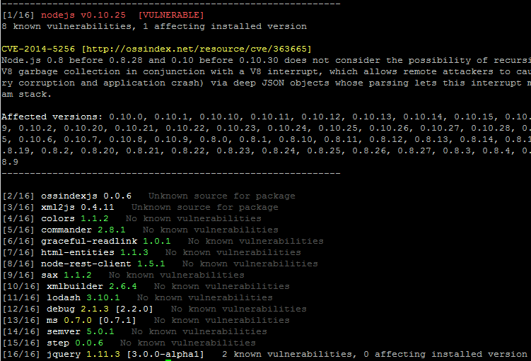
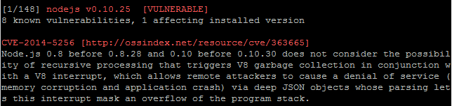

AuditJS
=======

Audits an NPM project using the [OSS Index v2 REST API](https://ossindex.net/docs/restapi2)
to identify known vulnerabilities and outdated package versions.



Installation
------------

```
npm install auditjs -g
```

Usage
-----

```
  Usage: auditjs [options]

  Options:

    -h, --help                   output usage information
    -V, --version                output the version number
    -p --package [package.json]  Specific package.json file to audit
    -v --verbose                 Print all vulnerabilities
```

Audit installed packages and their dependencies to identify known
vulnerabilities.

Execute from inside a node project (above the node_modules directory) to audit
the dependencies. 

If a package.json file is specified as an argument, only the dependencies in
the package file will be audited.

If a vulnerability is found to be affecting an installed library the package
header will be highlighted in red and information about the pertinent
vulnerability will be printed to the screen.



Running in verbose mode prints more descriptive output, and some extra information
such as ALL vulnerabilities for a package, whether they are identified as
impacting the installed version or not.

Limitations
-----------

As this program depends on the OSS Index database, network access is
required. Connection problems with OSS Index will result in an exception.

The current version of AuditJS only reports on top level dependencies.
If feedback indicates people are interested we will extend auditing to run
against the full dependency tree

The NVD does not always indicate all (or any) of the affected versions
it is best to read the vulnerability text itself to determine whether
any particular version is known to be vulnerable.

Credit
------

Data in OSS Index has been retrieved and cross referenced from several
sources, including but not limited to:

* npm: https://www.npmjs.com/
* The National Vulnerability Database (NVD): https://nvd.nist.gov/
* Node Security Project: https://nodesecurity.io/
